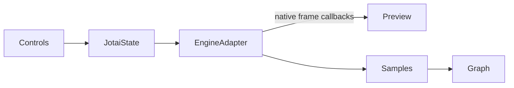

# Transition Visualizer

## Architecture
- Add the feature under [`src/components/2-main/transition-visualizer/`](src/components/2-main/transition-visualizer/) with separate `engines`, `state`, `controls`, `preview`, and `graph` folders; only [`src/components/2-main/index.tsx`](src/components/2-main/index.tsx) mounts it into the existing shell.
- Use Jotai for active library, per-library parameter bags, selected presets, run status, current view, and completed samples. Preserve each library’s settings when switching; React hooks remain limited to lifecycle/ref integration rather than application state.
- Define a typed adapter contract in [`model/engine.ts`](src/components/2-main/transition-visualizer/model/engine.ts):
```ts
type SamplePoint = { elapsedMs: number; value: number }
type EngineRun = { cancel(): void }
interface EngineAdapter<P> {
  id: "react-spring" | "motion" | "gsap"
  run(params: P, onFrame: (sample: SamplePoint) => void, onRest: () => void): EngineRun
}
```
- Record callbacks from each real library engine rather than applying shared spring math. A guarded run ID and adapter cleanup prevent stale callbacks and duplicate animations under React StrictMode.



## Controls and library models
- Build schema-driven controls from the project’s existing `Select`, `Input`, `Checkbox`, `Tabs`, `Button`, and labels; add a local accessible range/number control because no shared Slider exists.
- react-spring controls: mass, tension, friction, precision, velocity, and clamp, plus its default/gentle/wobbly/stiff/slow/molasses presets.
- Motion controls: stiffness, damping, mass, velocity, restSpeed, and restDelta. Keep this strictly physics-based; do not combine bounce/duration with stiffness/damping/mass because Motion overrides those options.
- GSAP controls: duration, core ease family/direction, and conditional parameters for elastic, back, and steps. Treat GSAP honestly as a duration-based tween/ease visualizer rather than labeling it a physical spring solver.
- Add the current `gsap` and `@gsap/react` packages with pnpm; retain the user’s existing `@react-spring/web` addition and installed `motion` package.

## Native engine adapters
- Implement [`engines/react-spring.ts`](src/components/2-main/transition-visualizer/engines/react-spring.ts) with the modern imperative SpringValue/Controller API, collecting `result.value.progress` and stopping the controller on cancel.
- Implement [`engines/motion.ts`](src/components/2-main/transition-visualizer/engines/motion.ts) with Motion’s numeric `animate` spring and its real update/completion callbacks.
- Implement [`engines/gsap.tsx`](src/components/2-main/transition-visualizer/engines/gsap.tsx) with a scoped `useGSAP` lifecycle, a numeric proxy tween, `onUpdate` sampling, and complete kill/revert cleanup.
- Normalize only the output scalar (`0 → 1` with possible overshoot); do not migrate or pretend to equate incompatible engine parameters.

## Preview and graph workflow
- Recreate the legacy concept as new responsive SVG artwork in [`preview/mechanical-spring.tsx`](src/components/2-main/transition-visualizer/preview/mechanical-spring.tsx): fixed anchor, deforming coil, equilibrium line, and moving mass. Drive it imperatively from native frame callbacks so animation frames do not trigger React/Jotai rerenders.
- Start in Preview. Run/Replay resets to `0`, animates toward `1`, records `{elapsedMs, value}`, and switches to Graph after the engine reports completion; Back returns to the preview. Parameter/library changes cancel the active run and clear stale results.
- Render [`graph/response-graph.tsx`](src/components/2-main/transition-visualizer/graph/response-graph.tsx) as responsive SVG using actual elapsed time on X and recorded displacement on Y. Include start/target references, duration, min/max, overshoot, empty/constant-data guards, and bounded point reduction; use a polyline/area path without splines that invent values.
- Keep physics duration emergent for react-spring/Motion and fixed for GSAP, with clear engine-specific labels.

## Integration and validation
- Update [`src/components/1-header/index.tsx`](src/components/1-header/index.tsx) from template branding to “Transitions Visualizer” while retaining the theme toggle, and make the main layout responsive for narrow and wide screens.
- Add focused Vitest coverage for schema defaults/presets, sample normalization/decimation, graph bounds, and stale-run cancellation utilities; avoid brittle timing snapshots of the animation libraries themselves.
- Verify `pnpm build`, Tailwind class ordering, and tests, then exercise all three libraries in the browser: switching preserves configs, Run/Replay/Back works, curves overshoot correctly, cancellation is clean, and light/dark plus mobile/desktop layouts remain usable.
- Reimplement concepts rather than copying legacy CSS/SVG/code; document the original MIT visualizer as inspiration if project documentation is updated.