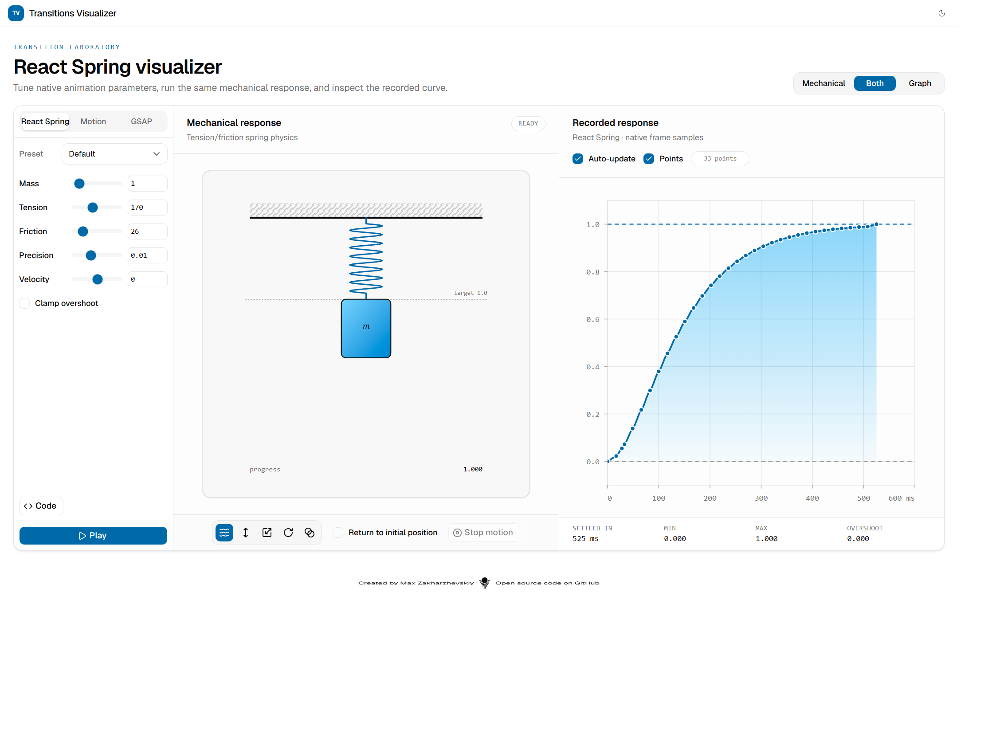
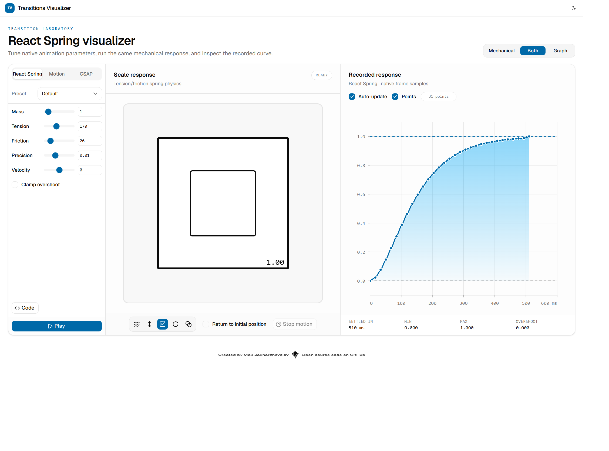
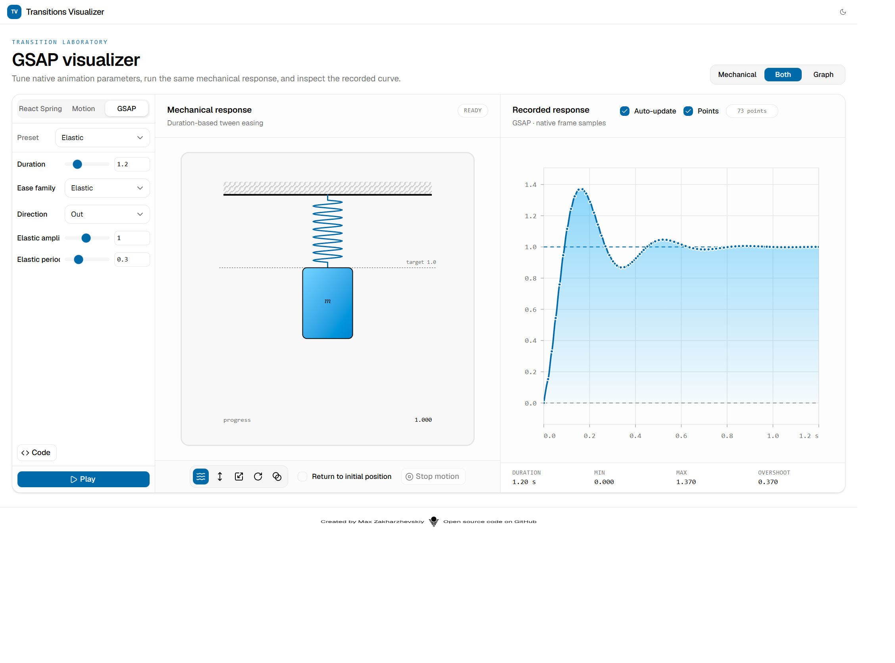
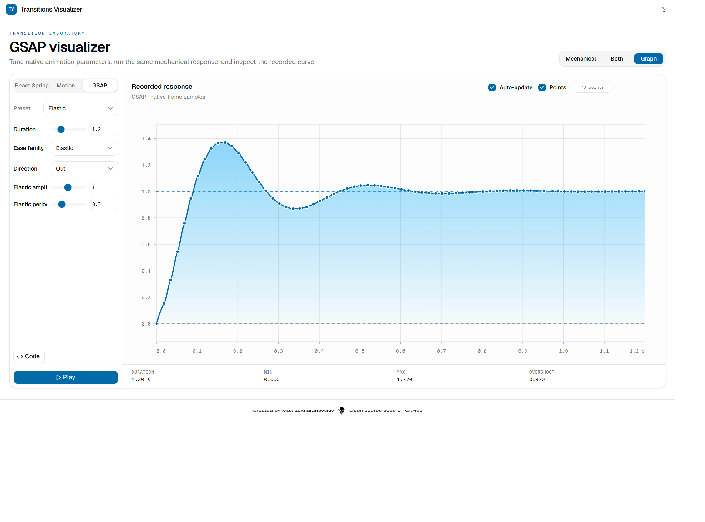

# Transitions Visualizer

A laboratory for tuning animation transitions and seeing how they actually behave. Each engine uses its native solver — React Spring, Motion, or GSAP — so the preview and the recorded curve match the library you will ship.

## Contents

- [Features](#features)
  - [Three native animation engines](#three-native-animation-engines)
  - [Live preview scenes](#live-preview-scenes)
  - [Recorded response graph](#recorded-response-graph)
  - [Playback and recording](#playback-and-recording)
  - [Code export](#code-export)
  - [Layout and persistence](#layout-and-persistence)
- [Screenshots](#screenshots)
- [Getting started](#getting-started)
- [Tech stack](#tech-stack)
- [Acknowledgments](#acknowledgments)

## Features

### Three native animation engines

Switch engines from the sidebar. Each tab keeps its own parameters and presets. Values are not remapped between libraries, because the solvers are not equivalent.

| Engine | Model | Tunable parameters | Presets |
| --- | --- | --- | --- |
| **React Spring** | Tension / friction physics | Mass, tension, friction, precision, initial velocity, clamp overshoot | Default, Gentle, Wobbly, Stiff, Slow, Molasses |
| **Motion** | Stiffness / damping spring | Stiffness, damping, mass, velocity, rest speed, rest delta | Default, Gentle, Bouncy, Snappy |
| **GSAP** | Duration-based tween easing | Duration, ease family, direction, plus ease-specific knobs (elastic amplitude/period, back overshoot, steps) | Elastic, Back, Bounce, Smooth, Linear |

Physics springs settle when the engine itself reports rest. GSAP runs for the duration you set. The graph axis is computed from those same rules before playback starts, so the plot does not rescale while a run is recording.

### Live preview scenes

The same normalized `0 → 1` value drives every preview. Choose a scene from the icon row under the stage:

- **Mechanical spring** — a hanging coil and mass. Mass and tension change the drawing; clamp draws a barrier at the target line.
- **Vertical translation** — a pill moves up from the bottom of the frame.
- **Scale** — a square grows from 50% to 100%, with static outlines at both sizes.
- **Rotation** — a card rotates through 90°.
- **Opacity** — a layer fades in, with a legend marker for the current value.

Each scene sits inside a framed canvas. Overshoot is allowed to leave the frame; the outline stays on top so the boundary remains visible.

### Recorded response graph

Every completed run is plotted from **native frame samples**, not an analytical approximation.

- Elapsed-time X axis and value Y axis, with a dashed baseline at `0` and a target line at `1`
- Monotone cubic curve that passes through each sample without inventing extra wiggles
- Optional sample dots (hide automatically when points are too dense)
- Footer stats: duration (or settled / stopped time), min, max, and overshoot
- Live **recording** indicator while a run is in progress

**Auto-update** replays and re-records whenever parameters change. **Points** toggles the sample dots. Both preferences are saved.

### Playback and recording

- **Play** starts the selected engine from `0` to `1` and records every frame.
- **Stop motion** cancels the current run; the graph keeps the samples collected so far.
- **Return to initial position** waits one second after settle, then eases the preview back to the start.

Runs cancel cleanly on engine switch, parameter change, unmount, and React Strict Mode remounts, so stale callbacks cannot overwrite a newer curve.

### Code export

The **Code** button opens a snippet for the active engine and parameters — a React Spring config object, a Motion `type: "spring"` transition, or a GSAP `{ duration, ease }` pair — ready to copy into your app.

### Layout and persistence

A single control switches the main stage:

| Mode | What you see |
| --- | --- |
| **Mechanical** | Preview only |
| **Both** | Preview and graph side by side |
| **Graph** | Recorded curve only |

The runner stays mounted in every mode, so graph-only still records. Light and dark themes, the display mode, graph options, and per-engine parameters persist in `localStorage`.

## Screenshots

React Spring default preset in split view: mechanical preview on the left, recorded curve on the right.



Scale preview using the same React Spring run. The framed square and 50% / 100% outlines show how a single progress value maps onto a transform.



GSAP elastic ease in split view. The graph shows overshoot past the target and the settle-back that duration-based easing produces.



Graph-only layout for the same GSAP run — useful when you want the curve at full width.



## Getting started

Requires [Node.js](https://nodejs.org/) and [pnpm](https://pnpm.io/).

```bash
pnpm install
pnpm dev
```

The app is served at [http://localhost:3000](http://localhost:3000).

| Script | Purpose |
| --- | --- |
| `pnpm dev` | Vite development server |
| `pnpm build` | Typecheck, then production build |
| `pnpm preview` | Serve the production build |
| `pnpm exec vitest run` | Unit tests for engines, graph plotting, and preview mappings |

## Tech stack

React 19, TypeScript, Vite, Tailwind CSS 4, and shadcn/ui. Visualizer state uses Jotai; persisted settings use Valtio. Animation engines are `@react-spring/web`, `motion`, and `gsap` / `@gsap/react`.

## Acknowledgments

* The mechanical spring metaphor and the five visualization modes are inspired by [Joost Kiens’ react-spring-visualizer](https://github.com/JoostKiens/react-spring-visualizer). This project is a from-scratch rewrite with three engines, live recording, and a modern React stack.

* [Motion library transitions](https://motion.dev/docs/react-transitions#spring-visualiser)
